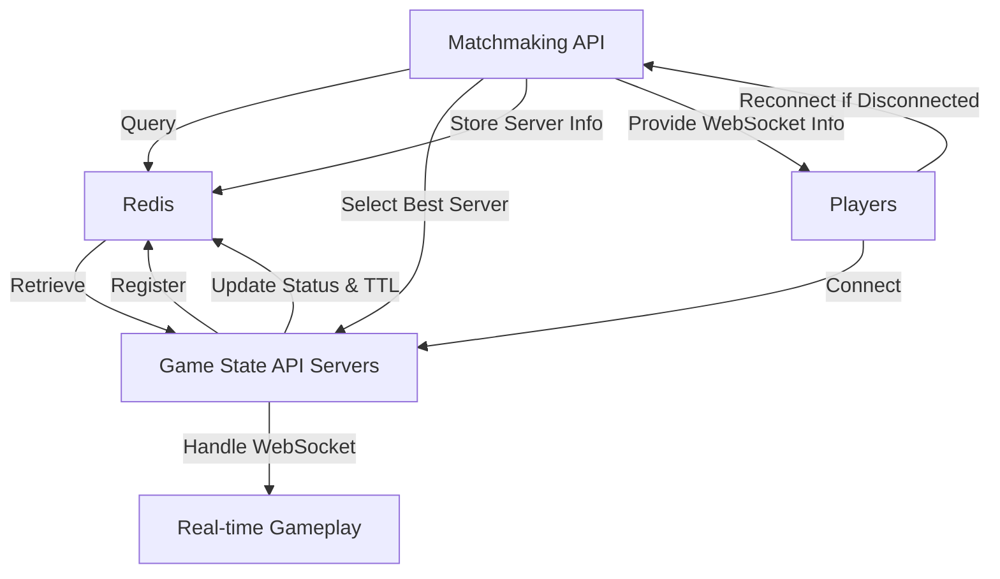
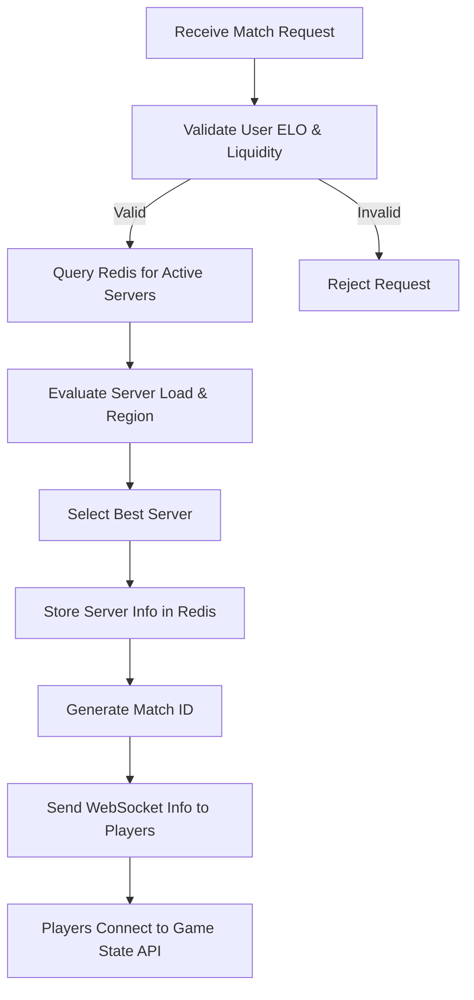
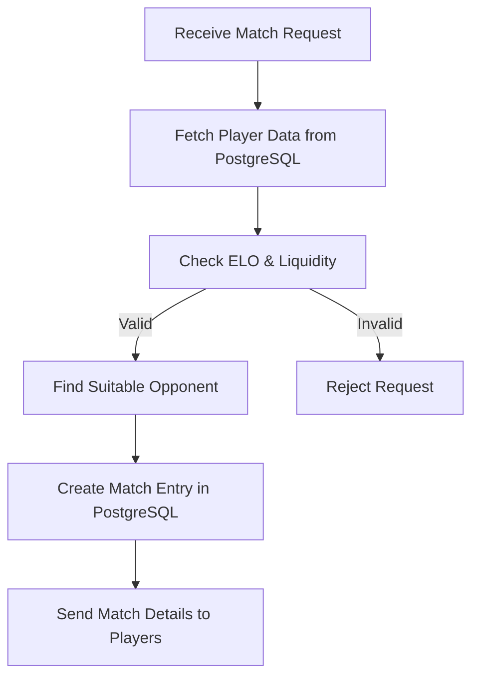

# Matchmaking API for Chess Betting App

## Overview

This service pairs users based on their ELO rating and a liquidity window, allowing them to play chess games where they can bet on the outcome. The matchmaking API communicates with the game state API using web sockets and Redis to manage game sessions and player connections.

## Architecture

The matchmaking API interacts with the game state API to facilitate real-time gameplay. The game state API servers register themselves in Redis and update their status periodically. The matchmaking API queries Redis to find the best game state API server for a match, ensuring optimal load distribution and regional considerations.

## Communication Flow

## Setup

1. **Redis Configuration**: Ensure Redis is running and accessible by both the matchmaking API and game state API servers.
2. **Game State API Registration**: Game state API servers must register themselves in Redis with their ID, IP, port, region, and load.
3. **Heartbeat Mechanism**: Game state API servers should periodically update their status and TTL in Redis to maintain active status.
4. **Matchmaking Logic**: The matchmaking API should implement logic to select the best game state API server based on load and region.

## Usage

- **Pairing Users**: Users are paired based on their ELO rating and liquidity window.
- **WebSocket Connection**: Players receive WebSocket connection information as part of the match metadata and connect to the assigned game state API instance.
- **Real-time Gameplay**: All gameplay events are managed through the game state API, ensuring smooth and responsive interactions.

## Reconnection

If a player disconnects, they can call the matchmaking API (or a dedicated reconnect API) to retrieve the assigned game state API information and rejoin the game.

## License

This project is licensed under the MIT License.

## Internal Logic Diagram

## Simple Matchmaking Logic Diagram

This simplified diagram shows how the matchmaking service matches players by communicating with a PostgreSQL database.

