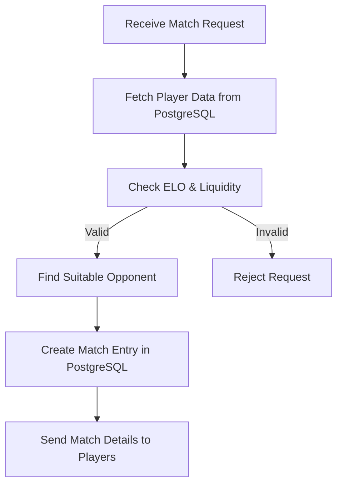
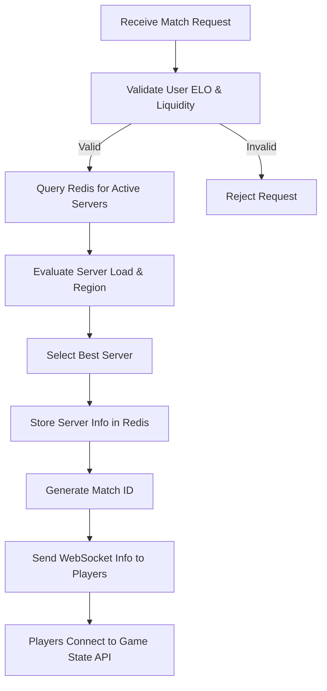
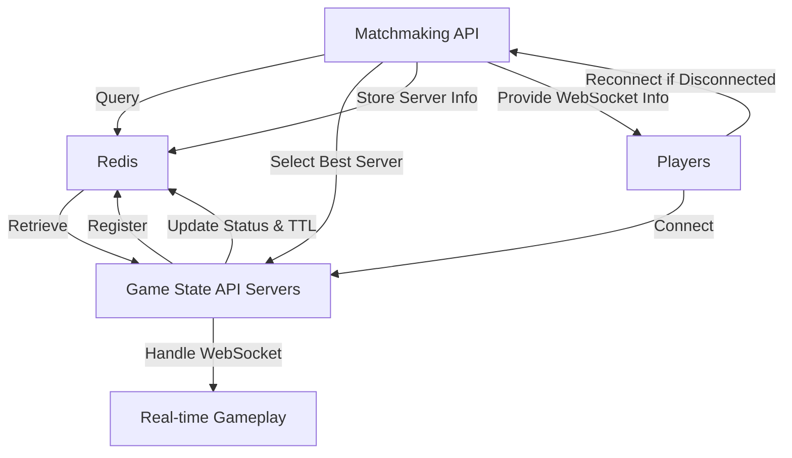

# Matchmaking API for Chess Betting App

## Overview

This service pairs users based on their ELO rating and a liquidity window, allowing them to play chess games where they can bet on the outcome. The matchmaking API communicates with the game state API using web sockets and Redis to manage game sessions and player connections.

## Basic Matchmaking Flow

This simplified diagram shows how the matchmaking service matches players by communicating with a PostgreSQL database.



## Internal Logic Flow

This diagram outlines the internal logic of the matchmaking service, from receiving a match request to selecting the best server and sending connection information to players.



## System Architecture and Communication Flow

The matchmaking API interacts with the game state API to facilitate real-time gameplay. The game state API servers register themselves in Redis and update their status periodically. The matchmaking API queries Redis to find the best game state API server for a match, ensuring optimal load distribution and regional considerations.



## Setup

1. **Redis Configuration**: Ensure Redis is running and accessible by both the matchmaking API and game state API servers.
2. **Game State API Registration**: Game state API servers must register themselves in Redis with their ID, IP, port, region, and load.
3. **Heartbeat Mechanism**: Game state API servers should periodically update their status and TTL in Redis to maintain active status.
4. **Matchmaking Logic**: The matchmaking API should implement logic to select the best game state API server based on load and region.

## Usage

- **Pairing Users**: Users are paired based on their ELO rating and liquidity window.
- **WebSocket Connection**: Players receive WebSocket connection information as part of the match metadata and connect to the assigned game state API instance.
- **Real-time Gameplay**: All gameplay events are managed through the game state API, ensuring smooth and responsive interactions.

## Reconnection

If a player disconnects, they can call the matchmaking API (or a dedicated reconnect API) to retrieve the assigned game state API information and rejoin the game.

## Features

- Express-based REST API
- TypeScript with strict type checking
- Zod schema validation
- OpenAPI documentation with Scalar
- Environment configuration
- Health check endpoint
- Task management endpoints with pagination

## Using Prisma

This project uses Prisma as its ORM for database operations. The Prisma client is already configured and can be imported in your code as follows:

```typescript
import { prisma } from '../../prisma/client.ts'
```

### Example Usage

```typescript
// Query all users
const users = await prisma.user.findMany()

// Create a new record
const newUser = await prisma.user.create({
  data: {
    email: 'user@example.com',
    name: 'John Doe'
  }
})
```

## Useful Commands
- `deno run --reload -A npm:prisma@latest init --db` - Creates a prisma directory containing a schema.prisma file for your database models
- `deno run -A npm:prisma migrate dev --name init` - It creates a new SQL migration file for this migration & runs the SQL migration file against the database
- `deno run -A npm:prisma@latest db push` - Pushes the latest schema changes to the database
- `deno run -A npm:prisma@latest db pull` - Pulls the latest schema changes from the database
- `deno run -A npm:prisma@latest db reset` - Resets the database
- `deno run -A --env prisma/seed.ts` - Seeds the database
- `deno run -A npm:prisma studio` - Opens the Prisma Studio

The Prisma client is initialized in `prisma/client.ts` and is ready to use throughout the application. The client is configured to work with the database specified in your environment variables (`DATABASE_URL`).

## Getting Started

### Prerequisites

- [Deno](https://deno.land/) installed on your machine
- Git for version control

### Installation

1. Clone the repository
2. Copy `.env.example` to `.env` and update the values
3. Run the dev server:

```bash
deno task dev
```

The server will start on the configured port (default: 8000).

## API Documentation

Interactive API documentation is available at:
- dev: `http://localhost:8000/api-docs`
- Production: `https://auth-api.notpossiblelabs.com/api-docs`

The raw OpenAPI specification is available at `/api-docs/json`.

## Project Structure

```
auth-api/
├── src/
│   ├── deps.ts            # Centralized dependencies
│   ├── main.ts           # Application entry point
│   ├── lib/              # Shared utilities
│   │   └── types.ts      # Shared TypeScript types
│   └── routes/           # API routes
│       ├── health/       # Health check endpoint
│       │   ├── health.api.ts    # OpenAPI spec
│       │   └── health.routes.ts # Route handlers
│       └── tasks/        # Task management endpoints
│           ├── tasks.api.ts     # OpenAPI spec
│           └── tasks.routes.ts  # Route handlers
├── .env                  # Environment variables
└── deno.json            # Deno configuration
```

## Route Structure

Each route module consists of two files:
1. `*.routes.ts` - Contains the Express route handlers and validation logic
2. `*.api.ts` - Contains the OpenAPI specification for the routes

### Route Naming Convention

API routes follow a consistent naming pattern:
```typescript
// api.ts
const {Resource}{Method}Route: OpenAPIPath = {
  "/resource": {
    method: {
      // OpenAPI specification
    }
  }
};

// Example:
const TasksGetRoute: OpenAPIPath = {
  "/tasks": {
    get: {
      // OpenAPI specification for GET /tasks
    }
  }
};

const TasksPostRoute: OpenAPIPath = {
  "/tasks": {
    post: {
      // OpenAPI specification for POST /tasks
    }
  }
};
```

### Route Implementation Example
```typescript
// routes.ts
import { Router } from "npm:express@4";
import { z } from "../../deps.ts";

const router = Router();

router.get("/tasks", (req: Request<{}, {}, {}, PaginationParams>, res: Response) => {
  // Route implementation with typed request/response
});

export const tasksRouter = router;
```

## Type Safety

The project uses TypeScript with strict type checking:

1. Request/response types are enforced through TypeScript
2. Request bodies are validated using Zod schemas
3. OpenAPI documentation is type-safe through the OpenAPIPath type
4. Pagination parameters and responses are fully typed

## Dependencies

- Deno standard library
- Express.js framework
- Zod for schema validation
- Scalar for API documentation

## Environment Variables

| Variable    | Description        | Default     |
|-------------|--------------------|-------------|
| PORT        | Server port        | 8000        |
| NODE_ENV    | Environment        | dev |
| HOST        | Production host    | -           |
| LOG_LEVEL   | Logging level      | debug       |
| DATABASE_URL| Database connection| file:dev.db |

## Best Practices

### Pagination

#### Page-Based Pagination
All list endpoints should implement page-based pagination using `page` and `limit` query parameters:

```http
GET /api/tasks?page=2&limit=20
```

Parameters:
- `page` (default: 1): The page number to retrieve
- `limit` (default: 10, max: 100): Number of items per page

#### Pagination Response Format
Responses include both the data array and pagination metadata:

```json
{
  "data": [
    {
      "id": "123e4567-e89b-12d3-a456-426614174000",
      "title": "Example Task",
      "description": "Task description",
      "status": "pending",
      "priority": "high",
      "createdAt": "2024-03-29T10:00:00Z"
    }
  ],
  "pagination": {
    "total_records": 100,
    "current_page": 1,
    "total_pages": 10,
    "next_page": 2,
    "prev_page": null,
    "has_more": true
  }
}
```

The pagination metadata helps clients to:
- Track their position in the dataset
- Calculate the total number of requests needed
- Navigate between pages efficiently
- Determine if more data is available

#### Implementation Example
```typescript
interface PaginatedResponse<T> {
  data: T[];
  pagination: {
    total_records: number;
    current_page: number;
    total_pages: number;
    next_page: number | null;
    prev_page: number | null;
    has_more: boolean;
  };
}

router.get("/tasks", (req: Request<{}, {}, {}, PaginationParams>, res: Response) => {
  const page = Math.max(1, Number(req.query.page) || 1);
  const limit = Math.min(100, Math.max(1, Number(req.query.limit) || 10));
  
  // Calculate pagination metadata
  const startIndex = (page - 1) * limit;
  const endIndex = startIndex + limit;
  const totalRecords = tasks.length;
  const totalPages = Math.ceil(totalRecords / limit);
  
  const response: PaginatedResponse<Task> = {
    data: tasks.slice(startIndex, endIndex),
    pagination: {
      total_records: totalRecords,
      current_page: page,
      total_pages: totalPages,
      next_page: page < totalPages ? page + 1 : null,
      prev_page: page > 1 ? page - 1 : null,
      has_more: page < totalPages
    }
  };
  
  res.json(response);
});
```